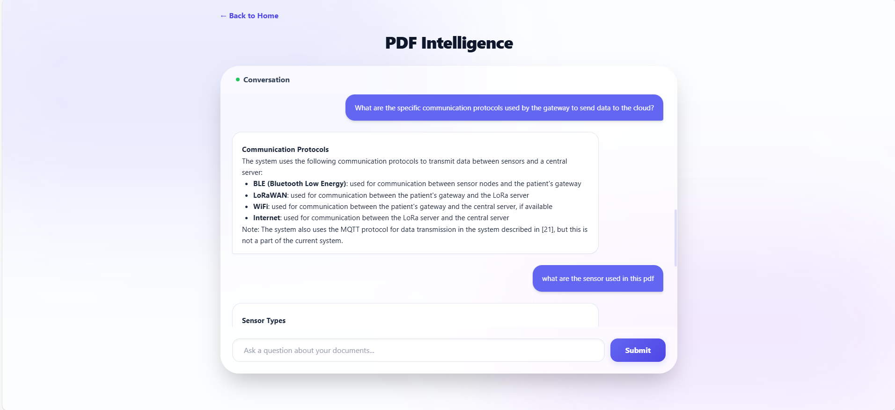
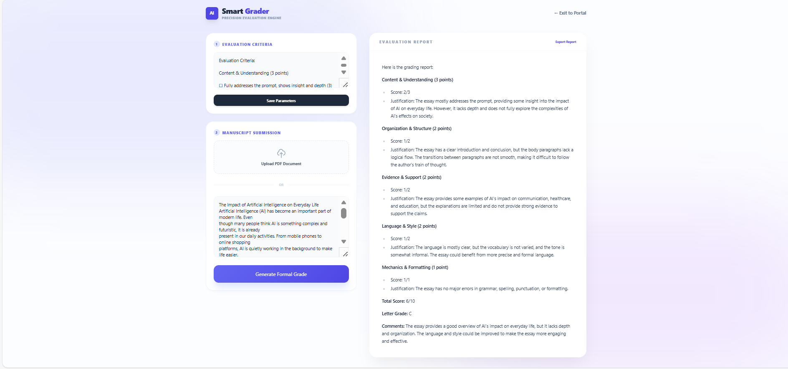

<h1>📚 ScholarBound AI – Smart PDF Chat & Essay Grader</h1>

<strong>An AI-powered academic platform for chatting with PDFs and grading essays using a custom rubric.</strong>

<h2>📌 Project Overview</h2>

<strong>ScholarBound AI</strong> allows users to:

<ul>
<li>Chat with uploaded PDF documents using RAG (Retrieval-Augmented Generation)</li>
<li>Automatically grade essays based on a user-defined rubric</li>
<li>Generate structured academic evaluation reports</li>
</ul>

The system uses <strong>OpenRouter LLM (Llama 3 8B Instruct)</strong>, not ChatGPT.

<h2>🔬 PDF Chat System (RAG)</h2>

<ul>
<li><strong>LLM:</strong> meta-llama/llama-3-8b-instruct (via OpenRouter)</li>
<li><strong>Framework:</strong> LangChain</li>
<li><strong>Vector Database:</strong> FAISS</li>
<li><strong>Embeddings:</strong> sentence-transformers/all-MiniLM-L6-v2</li>
<li><strong>Chunk Size:</strong> 1000 characters</li>
<li><strong>Chunk Overlap:</strong> 200 characters</li>
<li><strong>Top Retrieval:</strong> k = 10</li>
</ul>

The assistant answers only from the uploaded document and does not use outside knowledge.

<h2>📋 Essay Grading Engine</h2>

<ul>
<li>User provides custom grading rubric</li>
<li>LLM evaluates essay strictly using rubric criteria</li>
<li>Generates:</li>
<ul>
<li>Score for each criterion</li>
<li>Total score (out of 100)</li>
<li>Letter grade (A–F)</li>
<li>Short justification for each section</li>
</ul>
<li>Supports PDF upload or direct text input</li>
</ul>

<h2>🚀 Main Features</h2>

<ul>
<li>Multi-turn PDF conversation</li>
<li>Standalone question normalization</li>
<li>Strict document-grounded answers</li>
<li>Custom academic rubric grading</li>
<li>Markdown to HTML formatted report</li>
<li>Clean academic UI</li>
</ul>

<h2>📸 Project Screenshots</h2>

<table align="center" border="1" cellpadding="6">
<tr>
<td align="center">
 
<b>PDF Chat Interface</b>
</td>
<td align="center">
 
<b>Essay Evaluation Report</b>
</td>
</tr>
</table>

<h2>📖 How to Run</h2>

<ol>
<li>Clone Repository:
<pre>git clone https://github.com/your-username/scholarbound-ai.git</pre>
</li>

<li>Create <code>.env</code> file:
<pre>
OPENROUTER_API_KEY=your_api_key
LLM_MODEL=meta-llama/llama-3-8b-instruct
</pre>
</li>

<li>Install Requirements:
<pre>pip install flask langchain langchain-openai faiss-cpu PyPDF2 python-dotenv markdown sentence-transformers</pre>
</li>

<li>Run:
<pre>python app.py</pre>
</li>
</ol>

<h2>⚠️ Disclaimer</h2>

This grading system is designed to assist educators.
Final academic decisions should always be reviewed by a human examiner.

<i>Developed by <b>Vidhi</b></i>

